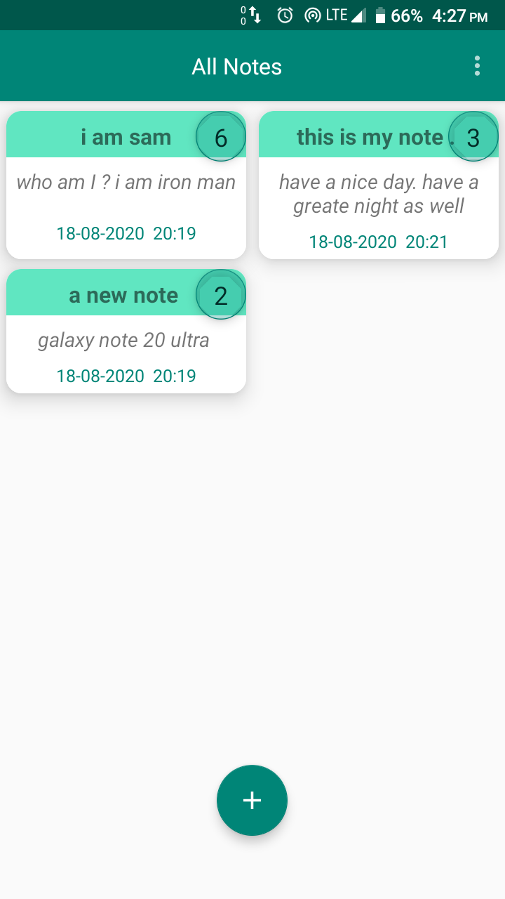
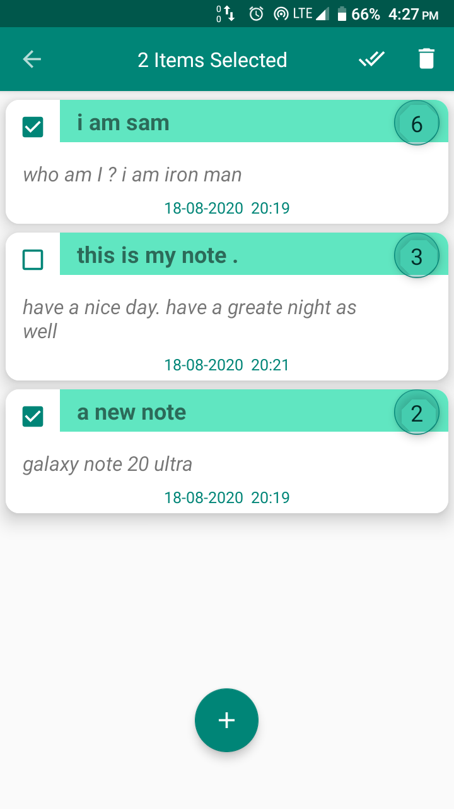
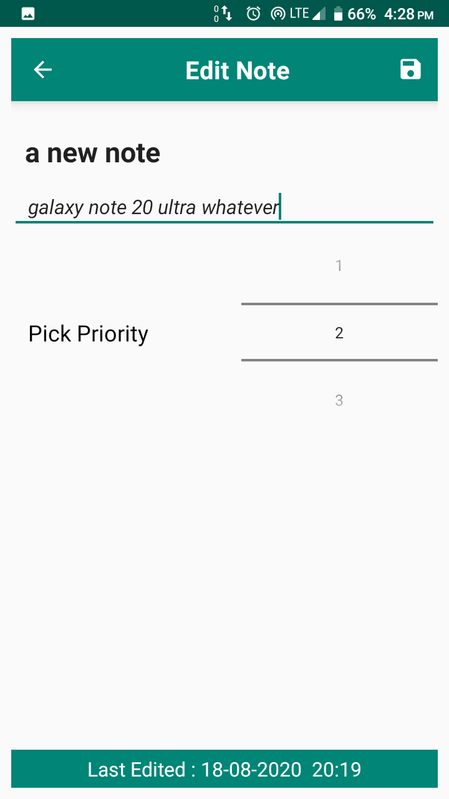
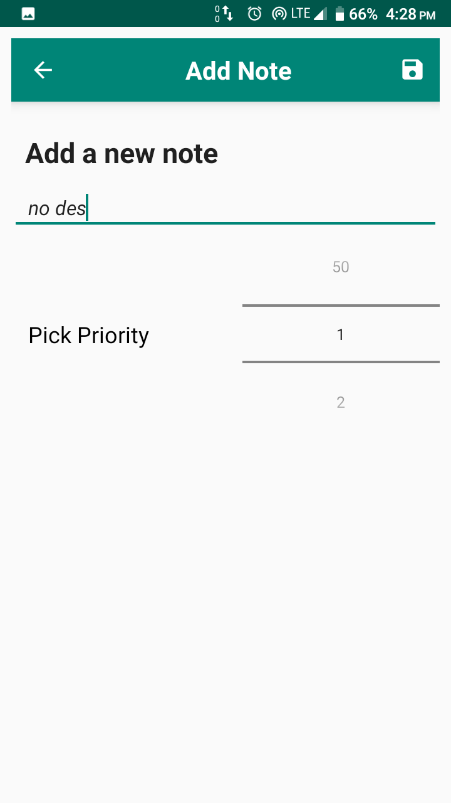

# TakeNotesApp
This is a simple app for taking notes and saving them.

Language Used : Java,Xml

Libraries/Features:
1.Romm Database.
2.ViewModels,Live Data.
3.MVVM architecture.
4.RecyclerViews etc

Screensorts:

